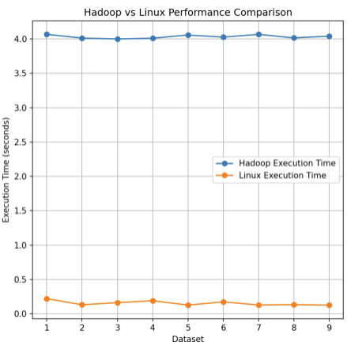
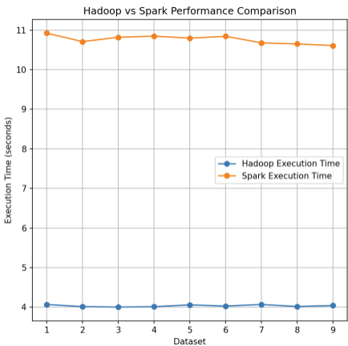

# TP2 - LOG8415E: MapReduce sur AWS

Authors : Stéphane Michaud 1904016 - Stephen Cohen 2412336 - Zabiullah Shair Zaie 2087651 - Asma Boukhdhir 2412257

---
- [TP2 - LOG8415E: MapReduce sur AWS](#tp2---log8415e-mapreduce-sur-aws)
- [WordCount Program Experiments](#wordcount-program-experiments)
  - [Setup](#setup)
  - [Results](#results)
    - [Hadoop VS Linux](#hadoop-vs-linux)
    - [Hadoop VS Spark](#hadoop-vs-spark)

---

# WordCount Program Experiments 

## Setup

We used the classic WordCount program to count occurrences of words in large text files. The input datasets were loaded from various sources, and we ran the WordCount algorithm using:

- Hadoop (with HDFS)
- Spark
- A simple Linux command pipeline (`cat`, `tr`, `sort`, `uniq`).

Each method was executed on different datasets to measure their performance on tasks of increasing size.

## Results

### Hadoop VS Linux

As we can observe, Linux is more efficient and `13 times` faster than Hadoop to realize those tasks. 

### Hadoop VS Spark

Here, Hadoop is `3 times` faster to complete this task than Spark on every dataset

